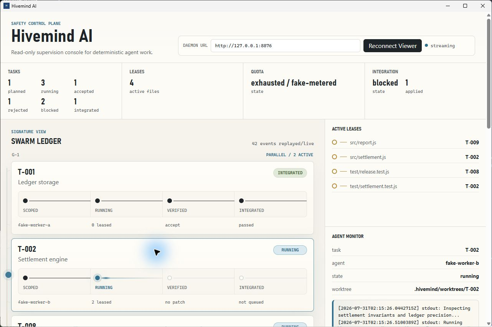
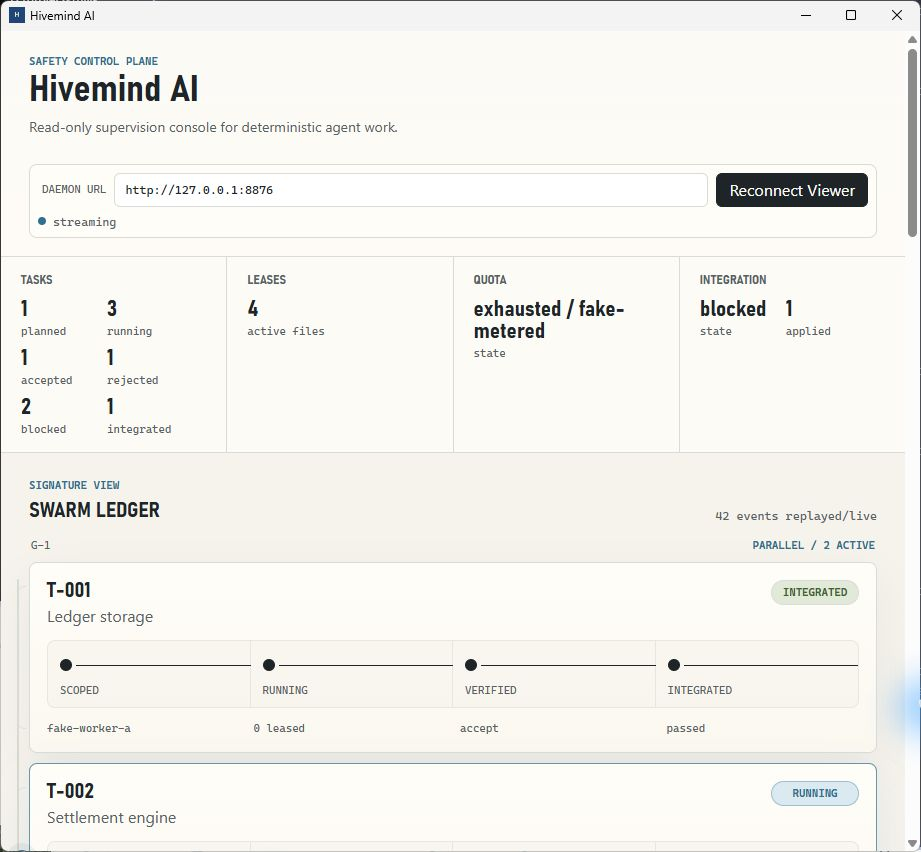

# Desktop board current-state review - 2026-07-30

## Runtime

- Native shell: Tauri release build from `desktop/`.
- Daemon: `http://127.0.0.1:8876`.
- Fixture repository: isolated no-paid repository under `%TEMP%`.
- Provider spend: none.
- Durable fixture: 42 authoritative events plus a five-record `T-002` output stream.
- Connection state at capture: streaming, with history replay complete.

The representative fixture contains:

- `G-1` with one integrated task and two simultaneously active task lanes.
- `G-2` with planned/dependency-waiting, accepted, rejected, blocked, quota-paused,
  and running tasks.
- Four active file leases.
- Selected-task worker stdout/stderr.
- Exhausted quota state.
- A configured-oracle `integration.blocked` event.
- M7.5 `routing.observed` and M7.7 `quality.*` events.

The fixture writes durable records directly for deterministic, no-paid visual
coverage. The final batch was loaded through the board's reconnect/history-replay
path; normal daemon-owned mutations publish the same durable records live.

## Screenshots

### Wide

The wide view shows the four summary instruments, mixed task lanes, active leases,
the selected `T-002` agent monitor, and its task-specific output stream.

### Compact

The compact view shows the responsive masthead, summary instruments, and Swarm
Ledger at a 921-pixel application width.

## Current renderer coverage

The board still renders the M6.2 foundation directly: task lifecycle, dependency
groups, grouped phases, leases, quota summary, integration summary, selected-task
output, and recent durable events.

Changes visible since the M6.2 polish evidence:

- M6.5 quota exhaustion is visible in the quota instrument. `task.paused` is
  represented as the existing generic `blocked` task state rather than a distinct
  quota-paused lane state.
- M6.7 `task.blocked` is rendered. A bare `task.failed` event is not projected into
  the task-state summary or lane, so failure is only visible in Recent Events unless
  another event establishes `blocked`.
- M7.6d `integration.blocked` and `integration.low_confidence` are first-class
  integration projection inputs. The fixture shows the integration instrument in
  `blocked`.
- M7.5 `routing.observed` has no routing/scorecard panel. It is visible only in
  Recent Events.
- M7.7 `quality.*` admission, draft, verification, and selection events have no
  quality-run visualization. They are visible only in Recent Events.

The visual shell is otherwise the M6.2 polish design: warm instrument palette,
four-phase Swarm Ledger, supporting lease/quota/integration instruments, and the
on-demand agent monitor.

## Authority and controls

The desktop app remains a thin read-only renderer over daemon SSE. It does not
contain a state-transition, gate, routing, or integration primitive. Selecting a
task changes only the observed output stream. `Reconnect Viewer` changes the
observation connection only.

There are no approve, redirect, ratify, run, submit, analyze, enqueue, integrate,
promotion, or quality-adoption controls.
